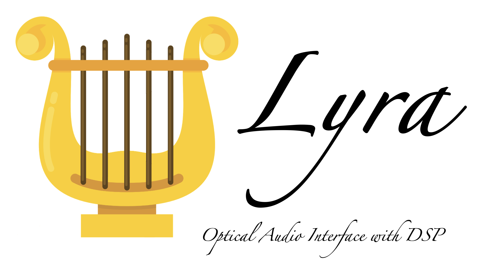

# LYRA — Quad Channel ADAT Optical Interface with Dual Channel Audio DSP ASIC




**LYRA** is an open-source audio processing ASIC designed for the **SkyWater 130nm (SKY130)** PDK. It integrates a dual-channel audio DSP, embedded programmable logic, multi-channel I2S audio interfaces, and a 4-channel optical ADAT encoder.

[Project docs are in the ./docs folder. Click here.](./docs/README.md)

## Key Features

* **Silicon PDK:** SkyWater 130nm (SKY130)
* **DSP Engine:** 2-channel core for real-time audio filtering and processing
* **Programmable Logic:** On-chip configurable logic block for custom routing and hardware acceleration
* **Audio Inputs:** 4× Stereo I2S inputs (8 total channels, 16/24-bit @ 44.1/48 kHz)
* **Audio Outputs:** 2× Stereo I2S outputs (local monitoring) + 1× 4-channel optical ADAT output (TOSLINK)
* **System Clock:** 11.2896 MHz (256 × 44.1 kHz) single clock domain

## Specifications

| Parameter | Specification |
| :--- | :--- |
| **Process Node** | SkyWater 130nm (SKY130) |
| **System Clock** | 11.2896 MHz (base for 44.1 kHz) |
| **Audio Format** | 16-bit @ 44.1 kHz / 48 kHz / 96 kHz |
| **Inputs** | 2× Stereo I2S |
| **Outputs** | 1× Stereo I2S + 1× Optical ADAT (8 Channels, 4 used) |
| **Area** | 300 um x 200 um |
| **Target Flow** | OpenLane / TinyTapeout 2x2 |

## Project Structure

* `rtl/` — SystemVerilog source files (I2S, DSP, logic array, ADAT encoder, top wrapper)
* `tb/` — Testbenches and simulation files
* `openlane/` — Synthesis, placement, and routing configurations
* `docs/` — Architecture specs and timing documentation

## Quickstart

### Simulation

Run testbenches using Icarus Verilog or Verilator:

```bash
cd tb
make
```

### ASIC Flow

Harden the top module using OpenLane:

```bash
make harden MODULE=lyra_top
```

## License

Copyright (c) 2026 Valerio Pagliarino.  
Licensed under the **Apache License, Version 2.0**.

