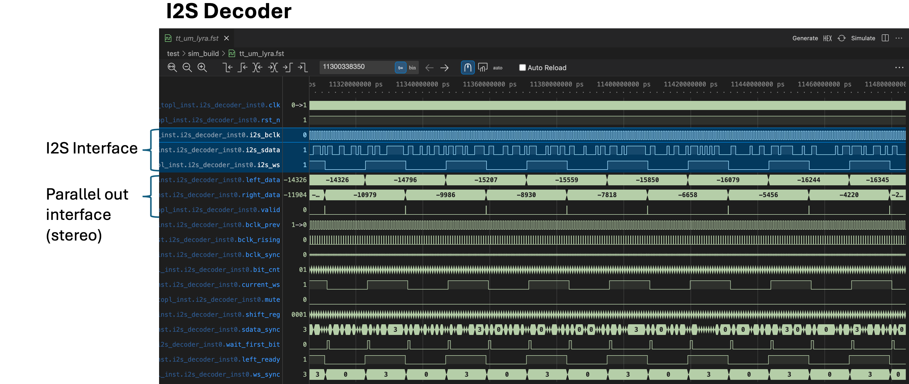
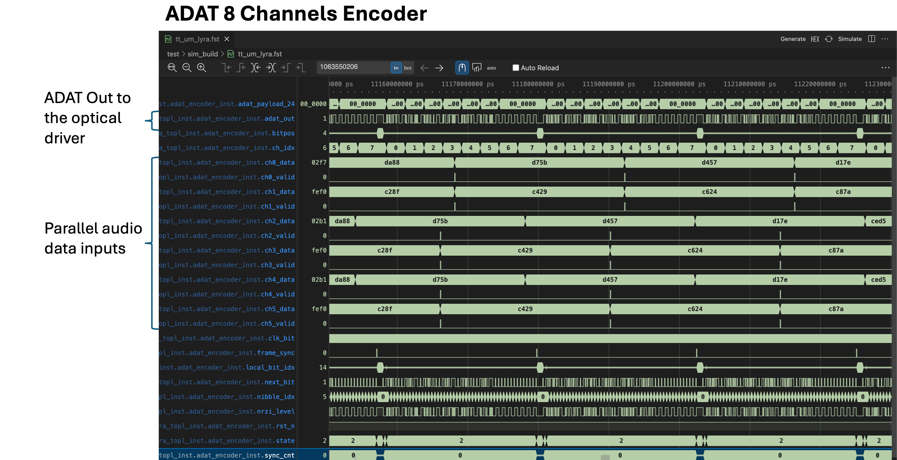
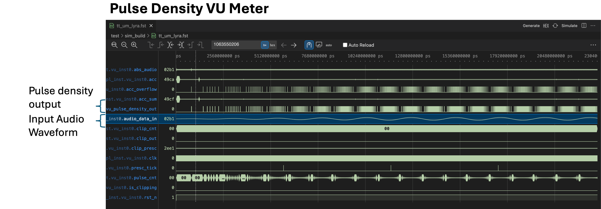

# LYRA — Quad Channel ADAT Optical Interface with Dual Channel Audio DSP ASIC


**LYRA** is an open-source audio processing ASIC designed for the **SkyWater 130nm (SKY130)** PDK. It integrates a dual-channel audio DSP, embedded programmable logic, multi-channel I2S audio interfaces, and a 4-channel optical ADAT encoder.

## Key Features

* **Silicon PDK:** SkyWater 130nm (SKY130)
* **DSP Engine:** 2-channel core for real-time audio filtering and processing
* **Programmable Logic:** On-chip configurable logic block for custom routing and hardware acceleration
* **Audio Inputs:** 4× Stereo I2S inputs (8 total channels, 16/24-bit @ 44.1/48 kHz)
* **Audio Outputs:** 2× Stereo I2S outputs (local monitoring) + 1× 4-channel optical ADAT output (TOSLINK)
* **System Clock:** 11.2896 MHz (256 × 44.1 kHz) single clock domain

## Specifications

| Parameter | Specification |
| :--- | :--- |
| **Process Node** | SkyWater 130nm (SKY130) |
| **System Clock** | 11.2896 MHz (base for 44.1 kHz) |
| **Audio Format** | 16-bit @ 44.1 kHz / 48 kHz / 96 kHz |
| **Inputs** | 2× Stereo I2S |
| **Outputs** | 1× Stereo I2S + 1× Optical ADAT (8 Channels, 4 used) |
| **Area** | 300 um x 200 um |
| **Target Flow** | OpenLane / TinyTapeout 2x2 |

## I2S Decoder

The ASIC is equipped with a 4-channel I2S decoder that converts incoming I2S audio streams into parallel data for processing by the DSP engine. The decoder supports standard I2S formats and can handle multiple sample rates.



## ADAT 8 Channels Encoder

Output data are sent to a 8-channel ADAT encoder that converts the processed audio data into a TOSLINK-compatible optical signal. The encoder supports 8 channels of audio, with 6 channels used in this design.
Channels 5 and 6 are used to send the unprocessed audio data from channels 1 and 2, while channels 1-2 carry the processed audio data from the DSP engine. Channels 3-4 are not processed by the DSP.




## Vu Meter

The design provides 4 VU Meters with pulse-density encoded outputs that can be connected to a simple leaky-integrating external opamp with gain and then connected to an analog vu meter instrument.




## Digital Signal Processor and its configuration

# LYRA Audio DSP and SPI Configuration Interface

## 1. DSP Overview

The `dsp` module implements a dual-channel, 16-bit PCM audio processor. Each input channel is independently captured, processed, and buffered before being released to the output interface.

### Main Features

| Feature                 | Description                                  |
| ----------------------- | -------------------------------------------- |
| Audio channels          | 2                                            |
| Input/output format     | Signed 16-bit PCM                            |
| Sample range            | `-32768 ... +32767`                          |
| Processing architecture | Time-multiplexed, single processing datapath |
| Channel arbitration     | Fixed priority: CH1 > CH0                    |
| Gain multiplication     | Serial shift-and-add                         |
| Compressor              | Envelope-based dynamic gain reduction        |
| Exciter                 | High-pass-derived harmonic enhancement       |
| Output limiter          | Symmetric 16-bit saturation                  |
| Bypass controls         | Independent compressor and exciter bypass    |
| Configuration           | 16-bit SPI register                          |
| Reset                   | Active-low reset via `rst_n`                 |

---

## 2. Audio Data Interface

The DSP exposes two independent input/output channels.

| Signal          | Width | Direction | Description                  |
| --------------- | ----: | --------- | ---------------------------- |
| `ch0_data_in`   |    16 | Input     | Channel 0 PCM sample         |
| `ch0_valid_in`  |     1 | Input     | Channel 0 sample-valid pulse |
| `ch1_data_in`   |    16 | Input     | Channel 1 PCM sample         |
| `ch1_valid_in`  |     1 | Input     | Channel 1 sample-valid pulse |
| `ch0_data_out`  |    16 | Output    | Processed channel 0 sample   |
| `ch0_valid_out` |     1 | Output    | Channel 0 output-valid pulse |
| `ch1_data_out`  |    16 | Output    | Processed channel 1 sample   |
| `ch1_valid_out` |     1 | Output    | Channel 1 output-valid pulse |

Audio samples use two's-complement representation:

$$
x \in [-32768,32767]
$$

Although the external ports are declared as `logic [15:0]`, signed casts are explicitly used where arithmetic operations are performed.

---

## 3. Input Capture and Channel Arbitration

Each channel has an independent input holding register:

```text
ch0_data_in ──> in_sample[0] ──> processing
ch1_data_in ──> in_sample[1] ──> processing
```

When `chN_valid_in` is asserted, the corresponding sample is captured and `pending[N]` is set.

The arbitration logic selects one pending channel at a time with fixed priority:

```text
CH1
 ↓
CH0
```

Therefore:

$$
sel =
\begin{cases}
1 & pending_1 = 1 \\
0 & pending_1 = 0 \land pending_0 = 1
\end{cases}
$$

This allows both audio channels to share the same processing datapath.

---

### 4. Processing State Machine

The processing engine consists of three states:

| State       | Function                               |
| ----------- | -------------------------------------- |
| `ST_IDLE`   | Wait for a pending input sample        |
| `ST_MULT`   | Execute serial gain multiplication     |
| `ST_FINISH` | Update channel state and commit output |

Processing sequence:

```text
             +-----------+
             |  ST_IDLE  |
             +-----+-----+
                   |
             pending sample
                   |
                   v
             +-----------+
             |  ST_MULT  |
             +-----+-----+
                   |
              9 iterations
                   |
                   v
             +-----------+
             | ST_FINISH |
             +-----+-----+
                   |
                   v
             +-----------+
             |  ST_IDLE  |
             +-----------+
```

The shared datapath reduces hardware resources at the cost of additional processing latency.

---

## 5. Compressor

### 5.1 Absolute Sample Value

For the selected signed sample:

$$
x = sample\_sel
$$

the magnitude is calculated as:

$$
|x| =
\begin{cases}
-x & x < 0 \\
x & x \ge 0
\end{cases}
$$

The result is stored in `abs_audio`.

---

### 5.2 Envelope Detector

Each channel maintains an independent envelope state:

```text
env[0]
env[1]
```

The envelope error is:

$$
\Delta E = |x| - E
$$

The new envelope is calculated as:

$$
E_{new} =
E +
\frac{\Delta E}{2^S}
$$

where $S$ is selected by `comp_speed`.

| `comp_speed` | Shift $S$ | Update coefficient |
| ------------ | --------: | -----------------: |
| `00`         |         4 |             $1/16$ |
| `01`         |         6 |             $1/64$ |
| `10`         |         8 |            $1/256$ |
| `11`         |        10 |           $1/1024$ |

A smaller shift corresponds to faster envelope tracking.

---

### 5.3 Compressor Threshold

The threshold is selected through `comp_thresh`.

| `comp_thresh` | Threshold |
| ------------- | --------: |
| `000`         |     30000 |
| `001`         |     26000 |
| `010`         |     20600 |
| `011`         |     16384 |
| `100`         |     11585 |
| `101`         |      8192 |
| `110`         |      5792 |
| `111`         |      4096 |

The signal level above the threshold is:

$$
E_{excess} = \max(0,E-T)
$$

where $T$ is the selected threshold.

---

### 5.4 Compression Ratio

The excess envelope is scaled using arithmetic shifts.

| `comp_ratio` | Operation        |
| ------------ | ---------------- |
| `00`         | $E_{excess}/128$ |
| `01`         | $E_{excess}/64$  |
| `10`         | $E_{excess}/32$  |
| `11`         | $E_{excess}/16$  |

The gain reduction term is:

$$
G_{sub} = gain\_sub
$$

and the gain coefficient is:

$$
G =
\begin{cases}
64 & G_{sub} \ge 192 \\
256-G_{sub} & G_{sub}<192
\end{cases}
$$

The nominal unity-gain coefficient is therefore:

$$
G_{unity}=256
$$

---

## 6. Serial Shift-and-Add Multiplier

The compressor gain multiplication is implemented using a serial shift-and-add architecture rather than a parallel multiplier.

The multiplication is:

$$
Y = X \cdot G
$$

with:

| Signal     |  Width | Type     |
| ---------- | -----: | -------- |
| `mult_a`   | 25 bit | Signed   |
| `mult_b`   |  9 bit | Unsigned |
| `mult_acc` | 25 bit | Signed   |

For each multiplier bit:

$$
ACC_{n+1} =
\begin{cases}
ACC_n+A_n & B_n=1 \\
ACC_n & B_n=0
\end{cases}
$$

with:

$$
A_{n+1}=2A_n
$$

and:

$$
B_{n+1}=\left\lfloor\frac{B_n}{2}\right\rfloor
$$

The multiplier processes all nine bits of `mult_b`.

The resulting audio value is scaled by $2^8$:

$$
Y_{comp}=\frac{ACC}{256}
$$

implemented as:

```systemverilog
comp_audio_calc = mult_acc[23:8];
```

---

## 7. Compressor Bypass

The compressor bypass control is active-low:

```text
comp_bypass_b
```

The compressor output is:

$$
Y_{comp} =
\begin{cases}
X & comp\_bypass\_b = 0 \\
Y_{compressed} & comp\_bypass\_b = 1
\end{cases}
$$

Thus, when bypass is asserted, the original signed PCM sample is passed directly to the next processing stage.

---

## 8. Exciter

The exciter generates a high-frequency component from the difference between the current signal and a first-order low-pass state.

The difference signal is:

$$
D = Y_{comp}-LPF
$$

The high-pass component is:

$$
HPF = Y_{comp}-LPF
$$

The low-pass state is updated according to:

$$
LPF_{new}
=
LPF+
\frac{D}{2^S}
$$

where $S$ is selected by `exciter_freq`.

| `exciter_freq` | Shift $S$ |
| -------------- | --------: |
| `00`           |         2 |
| `01`           |         3 |
| `10`           |         4 |
| `11`           |         5 |

The filter is implemented using arithmetic shifts, avoiding a hardware divider.

---

## 9. Harmonic Generation

The harmonic component is calculated as:

$$
H = HPF-\frac{HPF}{4}
$$

or equivalently:

$$
H=\frac{3}{4}HPF
$$

RTL implementation:

```systemverilog
harmonics = hpf - (hpf >>> 2);
```

---

## 10. Exciter Drive

The harmonic contribution is controlled by `exciter_drive`.

| `exciter_drive` | Contribution |
| --------------- | ------------ |
| `000`           | $0$          |
| `001`           | $H/16$       |
| `010`           | $H/8$        |
| `011`           | $H/8+H/16$   |
| `100`           | $H/4$        |
| `101`           | $H/4+H/8$    |
| `110`           | $H/2$        |
| `111`           | $H$          |

Therefore:

$$
E_{exc}=K_{drive}H
$$

where $K_{drive}$ is implemented using arithmetic shifts and additions.

---

## 11. Exciter Bypass

The exciter bypass control is active-high (after reset is is in bypass mode):

```text
exciter_bypass_b
```

The generated harmonic contribution is:

$$
E_{exc} =
\begin{cases}
0 & exciter\_bypass\_b=0 \\
K_{drive}H & exciter\_bypass\_b=1
\end{cases}
$$

---

## 12. Output Saturation

The final processed sample is:

$$
Y_{out}=Y_{comp}+E_{exc}
$$

A 17-bit signed accumulator is used to detect overflow.

The output is saturated to the PCM16 range:

$$
Y_{out} =
\begin{cases}
32767 & Y_{sum}>32767 \\
-32768 & Y_{sum}<-32768 \\
Y_{sum} & otherwise
\end{cases}
$$

Therefore:

$$
-32768 \le Y_{out} \le 32767
$$

This prevents two's-complement wraparound at the output.

---

## 13. Channel Synchronization

The DSP processes the two channels sequentially but releases them as a stereo pair.

The first completed channel is stored in:

```text
data_stage[channel]
```

The `processed[]` flags indicate which channel has already completed processing.

The second channel completes the processing batch when:

```systemverilog
batch_ready = processed[~active_ch];
```

At this point both outputs are updated:

```text
data_out[0]
data_out[1]
```

and both valid signals are asserted simultaneously.

This guarantees coherent stereo output timing.

---

## 14. SPI Configuration Interface

The `spi_regfile` module implements a 16-bit write-only SPI configuration interface.

| Signal       | Width | Direction | Description                |
| ------------ | ----: | --------- | -------------------------- |
| `spi_sck`    |     1 | Input     | SPI clock                  |
| `spi_mosi`   |     1 | Input     | Serial data input          |
| `spi_cs`     |     1 | Input     | Active-low chip select     |
| `spi_miso`   |     1 | Output    | Fixed to `0`               |
| `config_reg` |    16 | Output    | Latched configuration word |

The SPI signals are asynchronous with respect to `clk`. Synchronizer flip-flops are therefore used before edge detection.

---

## 15. SPI Data Transfer

A complete configuration transaction consists of 16 bits.

The data is shifted into `shift_reg` on every detected rising edge of `spi_sck`:

$$
SHIFT_{new}
=
\{SHIFT[14:0],MOSI\}
$$

After the sixteenth bit:

$$
config\_reg = SHIFT_{new}
$$

The interface does not contain a separate SPI register-address phase. The complete 16-bit word directly represents the DSP configuration.

---

## 16. Configuration Register Map

The 16-bit configuration register is divided as follows:

|      Bits | Field           | Width | Description               |
| --------: | --------------- | ----: | ------------------------- |
|   `[1:0]` | `route_output`  |     2 | Output routing            |
|   `[4:2]` | `comp_thresh`   |     3 | Compressor threshold      |
|   `[6:5]` | `comp_speed`    |     2 | Compressor envelope speed |
|   `[8:7]` | `comp_ratio`    |     2 | Compressor ratio          |
|  `[10:9]` | `exciter_freq`  |     2 | Exciter frequency         |
| `[13:11]` | `exciter_drive` |     3 | Exciter drive             |
|    `[14]` | Reserved        |     1 | Currently unused          |
|    `[15]` | Bypass          |     1 | Compressor/exciter bypass |

The corresponding top-level assignments are:

```systemverilog
route_output     = config_reg[1:0];
comp_thresh      = config_reg[4:2];
comp_speed       = config_reg[6:5];
comp_ratio       = config_reg[8:7];
exciter_freq     = config_reg[10:9];
exciter_drive    = config_reg[13:11];
comp_bypass_b    = config_reg[15];
exciter_bypass_b = config_reg[15];
```

Bit `[15]` currently controls both compressor and exciter bypass functions.

---

## 17. Output Routing

`route_output` selects the source of the final I2S output.

| `route_output` | Output source                |
| -------------- | ---------------------------- |
| `00`           | DSP processed CH0/CH1        |
| `01`           | Direct CH2/CH3               |
| `10`           | Direct CH0/CH1               |
| `11`           | DSP CH0/CH1 + direct CH2/CH3 |

For the mixing mode:

$$
Y_L=Y_{DSP,L}+Y_{CH2}
$$

$$
Y_R=Y_{DSP,R}+Y_{CH3}
$$

Because the current operands are declared as unsigned `logic [15:0]`, explicit signed casting and output widening should be used in this path if signed PCM addition is required.

---

## 18. Hardware Implementation Considerations

The DSP architecture is optimized for a compact digital-audio ASIC implementation.

Key characteristics are:

* Shared arithmetic datapath between the two channels.
* Serial shift-and-add multiplier instead of a parallel multiplier.
* Power-of-two scaling implemented with arithmetic shifts.
* First-order filtering without hardware division.
* Registered channel state.
* Deterministic FSM-based processing.
* Explicit signed arithmetic for audio calculations.
* 17-bit intermediate result for output saturation.
* Two-stage synchronization of asynchronous SPI inputs.
* Stereo output commitment only after both channels have completed processing.

The architecture therefore trades processing latency for reduced combinational area and simplified arithmetic hardware.
